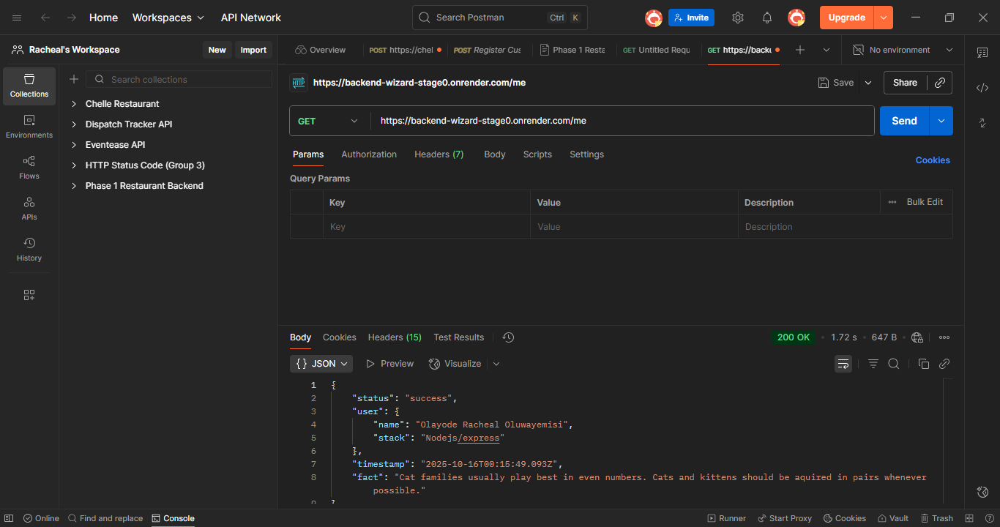

# Overview
This project is my submission for **Backend Stage 0** - a warm-up challenge designed to test the ability to build and structure a simple RESTful API.

The task was to create a **GET /me endpoint** that returns:
- My profile info (email, name, backend stack)
- A dynamic **cat fact** fetched from the [Cat Fact API](https://catfact.ninja/fact)
- A real-time **timestamp** in ISO 8601 (UTC) format

# Features
- Dynamic timestamp (updates every request)
- Graceful error handling if the external API fails
- Integration with an external API (Cat Facts)
- Structured JSON response
- Configurable via environment variables
- Ready for deployment on Render

# Tech Stack
- **Node.js** - Backend runtime
- **Express.js** - Web framework
- **Axios** - For making HTTP requests
- **Dotenv** - Environment variable management
- **CORS** - Cross-Origin support

# Project Structure
```bash
backend-wizards-stage0/
├── .env
├── package.json
├── server.js
├── package-lock.json
└── README.md
```

# Installation & Setup
### Clone the Repository
```bash
git clone https://github.com/Ifeoluwayemisi/backend_wizard_stage0.git 
cd backend_wizards_stage0
```

### Install Dependencies
```bash
npm install
```

### Create a .env File
Create a `.env` file using the `.env.example` file as a template.

### Run the Server
```bash
node server.js
```
Your server will start on: `http://localhost:5000/me`

# Example Response
```json
{
    "status": "success",
    "user": {
        "email": "youremail@example.com",
        "name": "Your Full Name",
        "stack": "Node.js/Express"
    },
    "timestamp": "2025-10-15T21:38:37.956Z",
    "fact": "A cat's brain is more similar to a man's brain than that of a dog."
}
```

# Error Handling
If the external Cat Facts API is unreachable, a fallback response is returned:
```json
{
    "status": "success",
    "user": {
        "email": "destinifeoluwa@gmail.com",
        "name": "Olayode Racheal Oluwayemisi",
        "stack": "Node.js/Express"
    },
    "timestamp": "2025-10-15T22:41:52.655Z",
    "fact": "Could not fetch cat fact at the moment, please try again later"
}
```

# API Documentation
[Postman Documentation](https://backend-wizard-stage0.onrender.com/me)

# Deployment
The project can be deployed on:
- Render
- Railway
- Heroku
- AWS Elastic Beanstalk

This project was deployed using **Render**.

# Environment Variables
| Variable    | Description                     |
|-------------|---------------------------------|
| `PORT`      | The port your server runs on    |
| `EMAIL`     | Your email address              |
| `FULL_NAME` | Your full name                  |
| `STACK`     | Your backend stack name         |

# Testing
You can test the API using:
- Postman
- cURL
- Browser (navigate to `${url}/me`)
- Thunder Client (VS Code extension)

# Screenshot/ Demo
[](https://backend-wizard-stage0.onrender.com/me)

# Reflection
This task taught me how to:
- Fetch and handle data from external APIs dynamically
- Format JSON responses consistently
- Handle network errors gracefully
- Maintain clean, environment-driven configurations

# Author
**Olayode Racheal Oluwayemisi**  
✉️ Email: destinifeoluwa@gmail.com  
🌐 GitHub: [@Ifeoluwayemisi](https://github.com/Ifeoluwayemisi)  
💼 LinkedIn: [Racheal Olayode](https://www.linkedin.com/in/olayode-rachael-3060a0340)

# License
This project is licensed under the **MIT License**.
